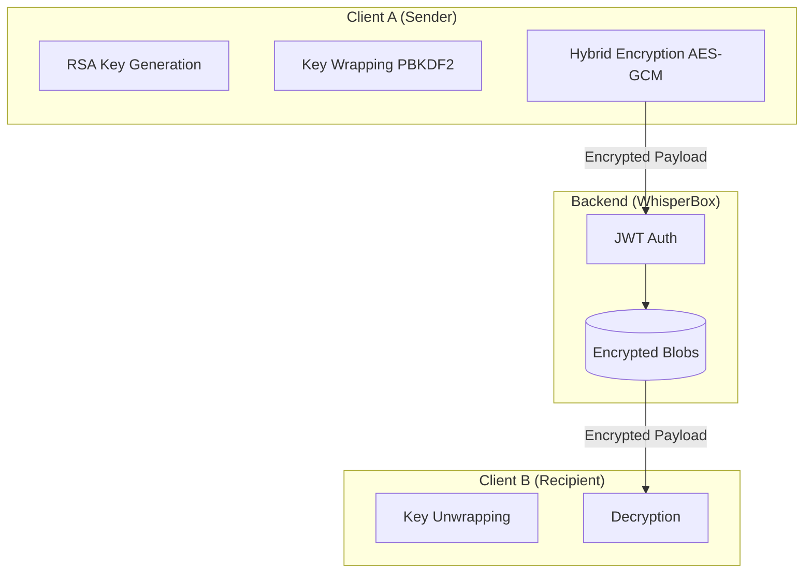

# Vault — End-to-End Encrypted Messaging

Vault is a "Zero-Knowledge" messaging application built with Next.js and the Web Crypto API. It ensures that your private conversations remain private by encrypting everything in the browser before it ever touches the network.

## 1. Architecture Overview

Vault follows a **Blind Postman** architecture. The server (WhisperBox) is responsible for routing and storing data, but it never possesses the keys required to read the messages.

## 2. Cryptographic Implementation

### Hybrid Encryption Flow
To balance security and performance, Vault uses a hybrid approach:
1.  **Identity (Asymmetric):** Each user generates a 2048-bit **RSA-OAEP** key pair.
2.  **Session (Symmetric):** For every message, a random 256-bit **AES-GCM** session key and a 96-bit **IV** are generated.
3.  **The Double-Lock:**
    *   The message is encrypted with the AES session key.
    *   The session key is then encrypted with the **Recipient's RSA Public Key**.
    *   The session key is also encrypted with the **Sender's RSA Public Key** (allowing the sender to view their own history).
4.  **Payload:** The server receives only the ciphertext, the IV, and the encrypted keys.

### Key Management & Wrapping
Vault allows users to log in from different devices without compromising the Private Key:
*   **PBKDF2 Derivation:** Upon registration, the user's master password is run through PBKDF2 with a random salt (100,000 iterations).
*   **AES-GCM Wrapping:** The RSA Private Key is encrypted using the derived key.
*   **Zero-Knowledge Storage:** The server stores the **Wrapped Private Key** and the **Salt**. Since the server never sees the master password, it can never "unwrap" the private key.

## 3. Security Trade-offs & Decisions

| Decision | Trade-off | Rationale |
| :--- | :--- | :--- |
| **AES-GCM Wrapping** | Increased Complexity | Replaced AES-KW to handle variable-length RSA keys without padding errors. |
| **Session Persistence** | Memory usage | The raw private key stays only in RAM. Refresh survives via temporary session-storage of the password. |
| **RSA-OAEP 2048** | Slower than ECC | Standardized compatibility with Web Crypto API across all modern browsers. |

## 4. Known Limitations

*   **No Forward Secrecy:** If a user's RSA Private Key is compromised, all past messages encrypted with that key could be decrypted. (Future improvement: Double Ratchet algorithm).
*   **Metadata Leakage:** The server knows *who* is talking to *whom* and *when*, even if it doesn't know *what* they are saying.
*   **Password Dependence:** If a user loses their master password, their messages are permanently unrecoverable.

